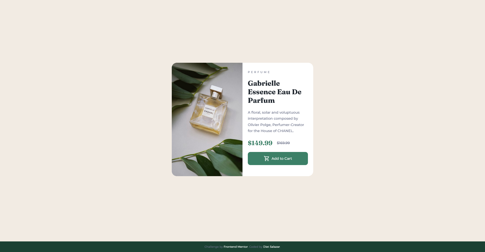

# Live Site URL
[https://dietsalazar.github.io/product-preview-card-component/](https://dietsalazar.github.io/product-preview-card-component/)

# Frontend Mentor - Product preview card component solution

This is a solution to the [Product preview card component challenge on Frontend Mentor](https://www.frontendmentor.io/challenges/product-preview-card-component-GO7UmttRfa). Frontend Mentor challenges help you improve your coding skills by building realistic projects. 

## Table of contents

- [Overview](#overview)
  - [The challenge](#the-challenge)
  - [Screenshots](#screenshots)
  - [Links](#links)
- [My process](#my-process)
  - [Built with](#built-with)
- [Author](#author)

**Note: Delete this note and update the table of contents based on what sections you keep.**

## Overview

### The challenge

Users should be able to:

- View the optimal layout depending on their device's screen size
- See hover and focus states for interactive elements

### Screenshots

<strong>Desktop</strong> 

<strong>Mobile</strong> 

### Links

- Solution URL: [https://github.com/dietsalazar/product-preview-card-component](https://github.com/dietsalazar/product-preview-card-component)
- Live Site URL: [https://dietsalazar.github.io/product-preview-card-component/](https://dietsalazar.github.io/product-preview-card-component/)

## My process

### Built with

- Semantic HTML5 markup
- CSS custom properties
- Flexbox
- CSS Grid
- Mobile-first workflow

## Author

- Frontend Mentor - [@dietsalazar](https://www.frontendmentor.io/profile/dietsalazar)

